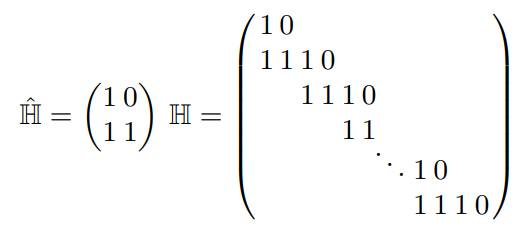
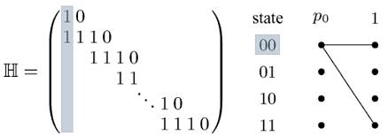

# STC-Steganography

A distortion limiting approach to Syndrome-Trellis Coding.

## Introduction

Steganography is the art of hiding information inside commonly shared media: inside text, images, audio or anything that could pass as regular data.

With this program, you can hide text inside images. With a few extra lines of code, anything that can be converted into binary can be hidden as well.

## Theory overview

This program was guided by Wadih Sawaya and is based on the works of Tomáš Filler, Jan Judas and Jessica Fridrich: "Minimizing Additive Distortion in Steganography Using Syndrome-Trellis Codes" and “Minimizing Embedding Impact in Steganography using Trellis codes quantization”. It’s ideal to have an overview of the contents of these articles before moving ahead, though not mandatory.

The problem of hiding data inside data can be approached two different ways: **PLS**, or Payload-Limited Sender (fixed payload size, minimizing distortion) and **DLS**, or Distortion-Limited Sender (fixed distortion value, maximizing payload). 

Syndrome-Trellis Coding attempts to minimize the distortion involved in embedding a fixed size payload. It’s a **PLS** approach. Its goal is to find the stego object **y** (the equivalent to the original cover image, but with information embedded into it), while also minimizing the distortion.

Deciding if a pixel is adequate for carrying extra information or not depends on the cost of embedding data into it. Higher cost means higher distortion and detectability. Lesser cost is better.

The process of embedding a message into a cover image is simple: 
	
	1. We create a structure called a trellis, which we’ll use to process the input;
	2. We scan and process the message, and use the output of the processing to “walk through” the trellis;
	3. When the entire input has been processed, we end up with either one or multiple candidates for the stego object y;
	3.1 Since we aim for undetectability, we select the one with the lowest cost and convert it into image format

###### Creating the trellis:

It needs 2h rows and _n ⋅ (w+1)_ columns, with _w_ and _h_ as the width and height of the **system key**, a small matrix called _Ĥ_. _n_ is the message size, in bits, after being converted to binary. 
We assume the only part of the system that is secret is its key, _Ĥ_. It should be known only by the sender and the receiver, and shared beforehand.
The rows are called states, each one a binary number, ranging from 0 to 2h-1. The columns are grouped into _m_ blocks, each one with _(w+1)_ columns.

###### Processing the input set 

We need to scan and process the set **{message, cover image, special matrix H}**. This will output binary bits at each step. These bits determine the steps we take through the trellis, as well as the _stego object_ **y**.

###### Constructing Ĥ

The special matrix H[αn, n] is constructed by placing the system key _Ĥ_ repeatedly, side by side, one row down each time, from `[0,0]` up until it reaches the right bound of _H_. _α_ is equal to the payload size and _n_ is the cover image size. If the last placement of Ĥ overflows by one or more rows, all overflowing elements are discarded. When finished, it should look like this:

The remaining positions in _H_ should be filled with zeros.

 ###### Traversing the trellis

We now need to traverse the trellis with the output we get from processing the inputs. The first node **y** visits is the one on the top left position (in the trellis we used as an example, that would be state 00 column p0: **s00p0**). After the initial node, the choice of the next nodes will differ: if we’re moving between blocks, it behaves one way; if we’re moving inside a block, it behaves another. 

**Inside blocks**, each node visited is linked to two nodes on the following column. The first one is always directly to the right, and corresponds to a 0 **y** bit, meaning we’re not reading any column of _H_ for this move. The other node’s position **does** take _H_ into account: the **y** bit associated is 1. Its state is determined by performing a modulo 2 operation (XOR, bit by bit) between the current node’s state and the ith column of _H_.

Like this:

One move directly to the right, one move with modulo 2: 00 ⊕ 11 = 11. Every next column inside a block consumes the next column of _H_.

**Between blocks**, it goes a little different: only nodes in states with a LSB (least significant bit) corresponding to the current message bit will be linked. A node’s following row is determined by slightly altering its state: we “push out” the LSB and push in, from the left, a 0. (e.g., with a current message bit of 1, 01 becomes 00; 11 becomes 01 and so on). At every end of block, a message bit is consumed. 

We link nodes until the last message bit has been accounted for, when we reach the final block. We’ll have in our hands the candidate(s) for **y**, that is, all the paths that managed to make it through the end. 

All nodes already have their costs (and total cost so far) stored, so we select the one with lesser total cost and convert it to image format, the same way we initially converted the cover image into a vector, but the other way around. 

And that’s it! We now have successfully hidden a piece of text into an image. Neat, huh?

## Extracting the message

Retrieving the message is done by solving H**y** = **m** (again, H is the matrix created from _Ĥ_ and **y** is the stego image. **m** is the message we’re looking for).

## Requirements

You’ll need:

	Python
	numpy, matplotlib, bitstring, ete3
	A command line!

If for some reason you don’t have everything you need by the time you run the code, don’t worry. The error message prompted on the command line will tell you what you need.

## Usage

You can either choose a message to hide or generate random sets of data, embed them and plot comparisons between their performances. The options are offered on the menu that’s prompted when you run the code, that looks like this: 

From this point on, all you need to do is follow the instructions you’ll see on the command-line!

## Troubleshooting

All inputs are checked for validity, in case you type in something invalid, the command-line should warn you. Just check what it says and you should be good to go.

Sometimes, the messages we choose are too large for embedding. Limited space, y’all. Try something shorter, maybe? (And no, we’re not converting directly to ASCII. We’re using Lempel-Ziv to decrease the size of the binary message during conversion. Feel free to change things up from here on!)

Happy hiding :-) 
